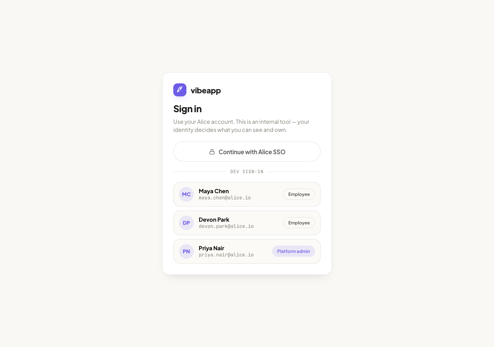
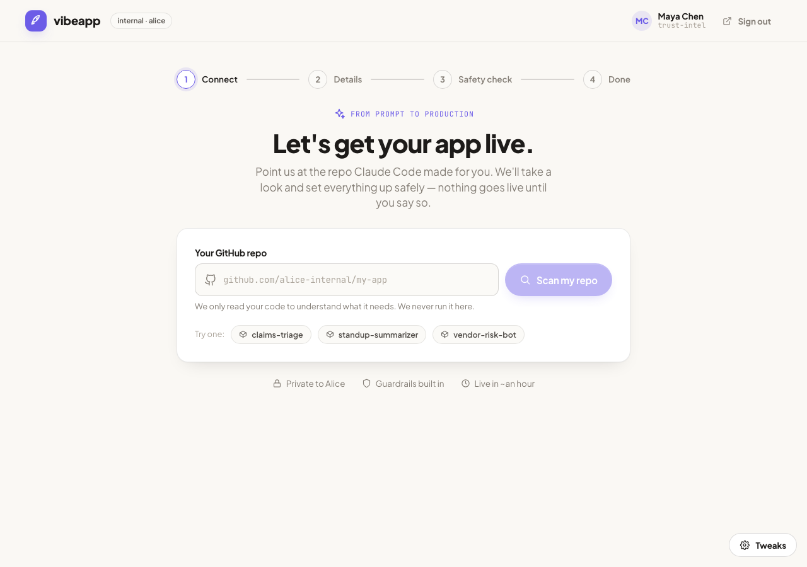
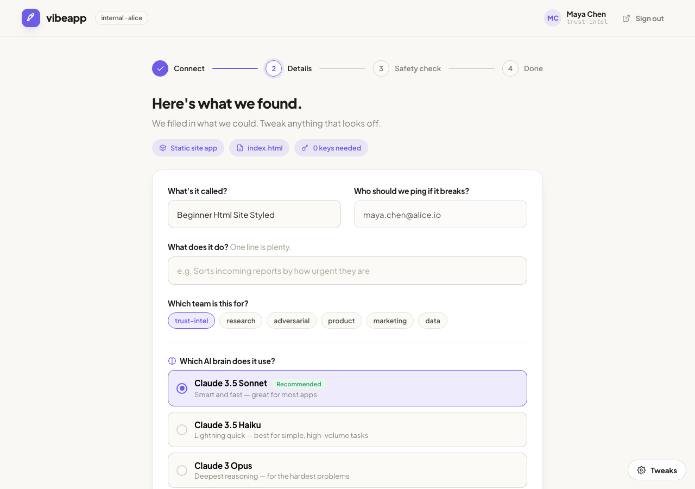
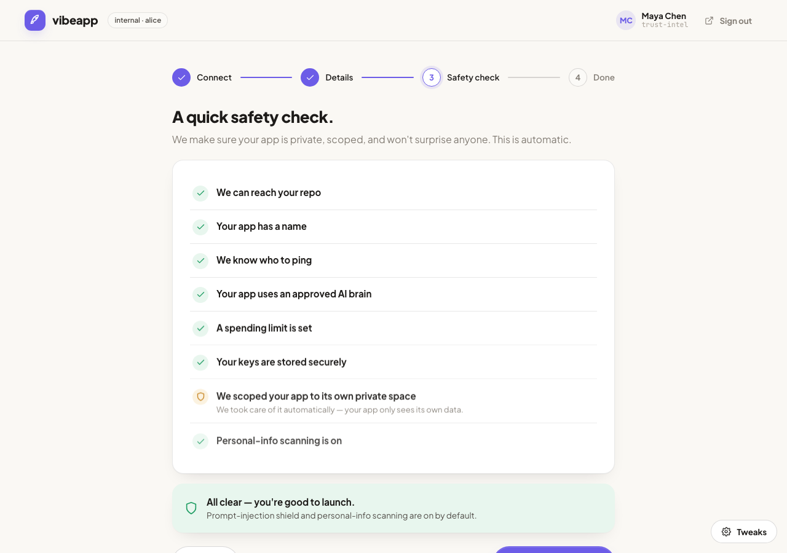
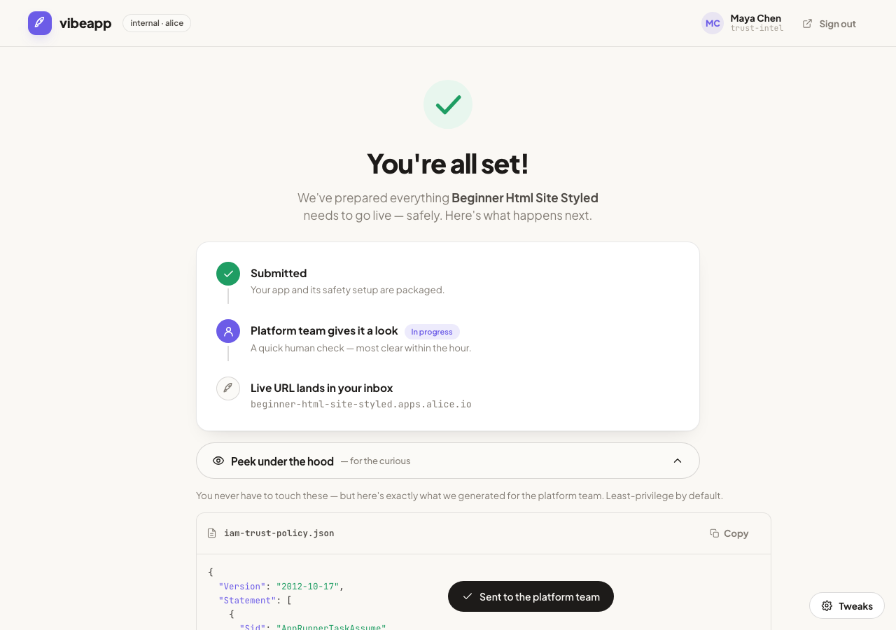
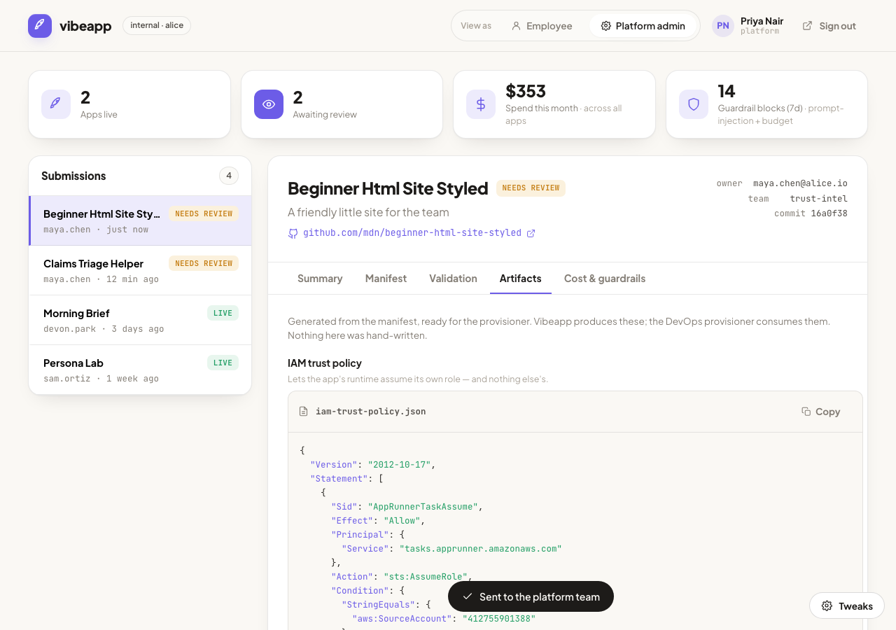
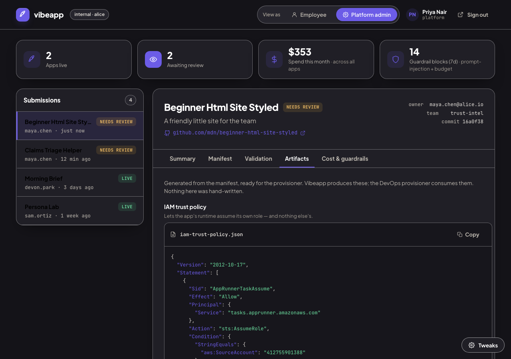

# Vibeapp — "submit a vibe-coded app" portal (Option D)

A small, runnable slice of an internal platform that takes a non-technical
employee from *"I vibe-coded an app with Claude Code"* to *"a live URL my team
uses"* — safely, without them touching Kubernetes, IAM, or secrets.

This implements **Deliverable 2, Option D**: a minimal API + UI that takes a
GitHub repo URL plus an app manifest, validates it, and produces the artifacts a
real provisioner would consume (IAM trust policy, least-privilege permissions,
deployment config, secrets bootstrap). It does **not** actually provision —
approval simulates a `provisioning → live` transition so the lifecycle is visible
end to end.

The full platform design is in **[DESIGN.md](./DESIGN.md)** (Deliverable 1).

### Screenshots

| Dev SSO sign-in | Employee — connect | Employee — detected (real scan) |
|---|---|---|
|  |  |  |

| Safety check | Done — peek at artifacts | Admin — generated artifacts |
|---|---|---|
|  |  |  |

| High-contrast + dark theme |
|---|
|  |

> The "detected" chips in screenshot 3 (`Static site · index.html · 0 keys`) come from a
> **real read-only scan** of `github.com/mdn/beginner-html-site-styled` — not mock data.
>
> Full walkthrough video: [`docs/videos/vibeapp-demo.mp4`](docs/videos/vibeapp-demo.mp4)
> (employee submits a real GitHub repo → admin approves → live).

---

## What's here

```
optionD/
├── backend/         FastAPI — the "provisioner-feeder". Validates + generates artifacts.
│   ├── app/
│   │   ├── settings.py     pydantic-settings (env-overridable, VIBEAPP_* prefix)
│   │   ├── config.py       Platform invariants (account, region, bucket, thresholds)
│   │   ├── catalog.py      Bedrock model allowlist
│   │   ├── scanner.py      Repo scan — real, read-only GitHub API (runtime/framework/secrets) + slugify
│   │   ├── manifest.py     vibeapp.yaml — single source of truth
│   │   ├── artifacts.py    The 4 artifacts (← the heart of Option D)
│   │   ├── validation.py   The submission gate
│   │   ├── cost.py         Projected LLM token cost
│   │   ├── auth.py         Mock SSO (dev) + RBAC dependencies
│   │   ├── errors.py       Domain exceptions → consistent {error, detail} envelope
│   │   ├── store.py        In-memory store behind StoreProtocol (DI-injected)
│   │   ├── deps.py         FastAPI dependencies (get_store)
│   │   ├── service.py      input → submission → {manifest, artifacts, validation, cost}
│   │   ├── routers/        health · auth · catalog · submissions
│   │   └── main.py         App factory + lifespan
│   └── tests/       57 tests, 100% coverage — least-privilege, validation, lifecycle, RBAC, errors, settings, scanner
└── frontend/        React + Vite + TypeScript (strict) — pixel-faithful vibeapp UI
    └── src/
        ├── types.ts            API model types (mirror backend schemas)
        ├── api/                client.ts (typed fetch) + queries.ts (TanStack Query hooks)
        ├── theme.css           Design tokens (light/dark/3 looks/density + high-contrast)
        ├── auth/Login.tsx      Dev SSO sign-in
        ├── employee/           Friendly 4-step wizard
        ├── admin/              Platform-admin console (declarative polling)
        ├── components/         Icons, code block, steps, tweaks panel
        └── test/               31 Vitest tests (99.3% cov) — flows, hooks, components
    └── e2e/                Playwright — demo recorder + screenshot capture
```

The frontend faithfully recreates a [Claude Design](https://claude.ai/design)
handoff; the visual system (Plus Jakarta Sans + JetBrains Mono, warm radii, soft
shadows) is preserved, with **high-contrast theme** and **keyboard/ARIA
accessibility** added on top. Server-state is managed with **TanStack Query**
(caching + declarative polling for the `provisioning → live` transition).

---

## How to run

Two terminals. Backend on `:8000`, frontend on `:5173` (Vite proxies `/api` → backend).

**Backend** (needs [uv](https://docs.astral.sh/uv/), or use `pip`):

```bash
cd backend
uv sync
uv run uvicorn app.main:app --reload --port 8000
# tests:
uv run pytest
```

<details>
<summary>Without uv (plain pip)</summary>

```bash
cd backend
python -m venv .venv && source .venv/bin/activate
pip install -e ".[dev]"   # or: pip install fastapi "uvicorn[standard]" pydantic pytest httpx
uvicorn app.main:app --reload --port 8000
pytest
```
</details>

**Frontend**:

```bash
cd frontend
npm install
npm run dev          # open http://localhost:5173
npm run typecheck    # tsc --noEmit (strict)
npm run test         # vitest
npm run build        # type-check + production build
```

> If your `:8000` is occupied, run the backend on another port and start Vite with
> `VIBEAPP_API=http://localhost:8077 npm run dev`.

**Or run the whole stack in Docker** (nginx serves the build and proxies `/api`):

```bash
docker compose up --build
# open http://localhost:8080
```

**Sign in:** the login screen offers one-click dev identities — **Maya Chen**
(employee) or **Priya Nair** (platform admin). The admin sees the review queue and
the `View as` switch; an employee sees only the submit wizard.

**Try the full loop:** sign in as Maya → paste/pick a repo → *Scan* → fill the
friendly form → *Run safety check* → *Submit*. Sign out, sign in as Priya → the
app is in the queue → open **Artifacts** to see the generated IAM/deploy/secrets
files → **Approve & provision** → watch it flip `provisioning → live`.

---

## Testing & coverage

```bash
cd backend  && uv run pytest --cov=app   # 57 tests
cd frontend && npm run coverage          # 31 tests (vitest + RTL)
```

| Layer | Tests | Coverage (statements) |
|---|---|---|
| **Backend** (FastAPI) | 57 | **100%** |
| **Frontend** (React/TS) | 31 | **99.3%** |

- **Backend is 100%** — that's where the logic and security invariants live. Tests
  pin least-privilege scoping (incl. an adversarial app-name that must not escape its
  prefix), validation gating, the approve→provision→live lifecycle, RBAC, the error
  envelope, settings overrides, and the real scanner (GitHub layer mocked — no network
  in tests).
- **Frontend is 99.3%** — full employee wizard + admin console flows driven through
  TanStack Query with a mocked API, plus component/hook unit tests. The remaining
  fraction is defensive `catch` blocks and an SSR/no-`localStorage` fallback branch I
  chose not to force-cover artificially. End-to-end is additionally verified in a real
  browser via Playwright (`frontend/e2e/`).

## Architecture & code quality (SOLID / DRY / structure)

**Single responsibility / file boundaries.** Each backend module does one thing:
`scanner` reads repos, `manifest` builds the spec, `artifacts` emits the four files,
`validation` is the gate, `cost` projects spend, `auth` is identity, `store` is
persistence, `service` wires input→derived, routers are thin HTTP adapters. The
frontend mirrors this: `api/` (data layer), `components/` (presentational),
`employee/` + `admin/` (feature views), `types.ts` (the contract).

**Dependency inversion / open-closed.** Routes depend on a `StoreProtocol`, not the
concrete in-memory store — swap in DynamoDB without touching a route. The scanner and
auth are seams: the GitHub scan or the dev-SSO login can be replaced behind the same
interface (`RepoScan`, `User`) with zero downstream change. Models, guardrails, and
platform invariants are data (`catalog.py`, `settings.py`), so extending them needs no
code change.

**DRY.** One artifact generator feeds both the employee "peek" and the admin tabs;
one `build_detail` produces manifest+artifacts+validation+cost for both create and
fetch; one typed `request<T>()` wrapper backs every call; one set of design tokens
(`theme.css`) drives all theming. Identity is derived once, server-side, never
duplicated from the request body.

**Separation of concerns.** Artifact generation lives server-side (a provisioner
calls an API, not a browser); the React app only renders. Config is environment-driven
(`pydantic-settings`); errors map to one consistent envelope in one place.

## Design decisions worth calling out

- **The artifacts live server-side, not in the UI.** The original design computed
  them in the browser; the real value of Option D is a backend a provisioner can
  call, so generation, validation, and cost projection moved to FastAPI. The React
  app only renders what the API returns.
- **Least-privilege is an invariant, not a knob.** The IAM scoping (one Bedrock
  model, one S3 prefix, one secrets namespace) is computed from the slug and cannot
  be widened by request input. A test feeds a malicious app name (`../* OR s3:::*`)
  and asserts it can't break out of its prefix.
- **Identity comes from the session, not the request body.** A submission's owner
  is the authenticated user; you can't submit "as" someone else. Admin actions
  (approve / retire) are gated to the admin role. Dev SSO is a one-click stand-in
  for a real OIDC flow — swapping it is a change isolated to `auth.py`.
- **Async lifecycle without a job queue.** Approval returns `provisioning`
  immediately and a timer thread flips it to `live`, modelling a real async
  provisioner while staying a single process. The UI polls.

---

## What I'd do next given another full day

1. **Real provisioner handshake.** Persist artifacts to S3 / a `git` PR against an
   infra repo and emit an event the DevOps provisioner consumes — making the
   ownership boundary in DESIGN.md executable, not just documented.
2. **Deeper repo scan.** The scanner already reads real repos read-only via the
   GitHub API (runtime, framework, entrypoint, Dockerfile, `.env` secret refs). Next:
   full-source secret grep (`os.environ`/`process.env`), private-repo tokens per org,
   and caching to respect rate limits.
3. **Persistence + idempotency.** Swap the in-memory store for DynamoDB/Postgres
   behind the same repository interface; make submit idempotent on `(repo, commit)`.
4. **Live cost attribution.** Wire the observability MCP endpoint (Option B) so the
   admin cost panel shows *actual* per-app/per-user token spend, not just a
   projection.
5. **Manifest schema versioning + a `vibeapp.yaml` the employee can commit** to
   their repo, so re-submits are declarative.
6. **Harden auth:** real OIDC token validation, signed sessions, CSRF, audit log of
   every approve/retire.

---

## AI tools used — where they helped, where I overrode them

> The AI workflow is also committed as concrete artifacts: **[`CLAUDE.md`](./CLAUDE.md)**
> (project rules driving Claude Code), **[`.cursor/rules/vibeapp.mdc`](./.cursor/rules/vibeapp.mdc)**
> (same rules for Cursor), and **[`AGENTS.md`](./AGENTS.md)**. The brainstorm→spec→plan
> trail is in `docs/superpowers/`.

**Claude Code (this build).** Used as the primary co-engineer end to end: reading
the assignment + the Claude Design handoff, porting the client-side prototype into a
FastAPI backend + React frontend, and writing tests.

Where it helped most:
- Mechanically porting the prototype's artifact generators and the icon/CSS design
  system from JSX into a clean Python service + React modules, fast and faithfully.
- Generating the test matrix for least-privilege invariants and the approve
  lifecycle.

Where I steered / overrode it:
- **Moved artifact generation to the backend.** The prototype (and the obvious
  port) kept it in the browser. That's wrong for Option D — the artifacts *are* the
  product and must come from an API a provisioner can call. I made the frontend a
  pure renderer.
- **Made least-privilege a tested invariant, not a template.** Rather than trust the
  generated JSON, I added an adversarial test (malicious app name) so the security
  property is enforced, not assumed.
- **Pushed identity to the session.** When SSO was added, the easy path was to keep
  trusting `ownerEmail` from the form. I overrode that so owner = authenticated user
  and gated admin actions by role — the honest security posture.
- **Kept scope honest.** Declined to build a real provisioner or DB for the slice;
  stubbed AWS with interfaces that don't lie about what's real.
- Verified the UI in a real browser (Playwright) against the running backend rather
  than trusting that it "should" render.
